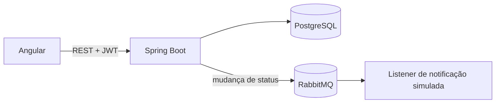

# Supply Chain

Monorepo para cadastro e rastreio de pacotes, com API Spring Boot e interface Angular. Os dados são persistidos no PostgreSQL e cada alteração de status publica um evento no RabbitMQ.

- [`api/`](./api): API REST em Spring Boot (Java 17, PostgreSQL, RabbitMQ). Veja [api/README.MD](./api/README.MD).
- [`web/`](./web): Frontend em Angular (TypeScript, Tailwind, i18n PT-BR/EN-US). Veja [web/README.md](./web/README.md).

## Arquitetura



- [`api/`](./api): Java 17, Spring Boot, Spring Security, JPA, PostgreSQL e Spring AMQP.
- [`web/`](./web): Angular, TypeScript, Tailwind CSS e traduções PT-BR/EN-US.
- [Decisões e limitações arquiteturais](docs/architecture.md).

## Recursos verificados

- criação e consulta de pacotes por API REST;
- busca por código de rastreio no frontend, com estados de carregamento, sucesso, vazio e erro;
- atualização de status autenticada;
- autenticação JWT com usuários registrados sempre no papel `OPERADOR`;
- persistência no PostgreSQL;
- publicação e consumo de evento de mudança de status pelo RabbitMQ;
- endpoints Actuator `health` e `info` sem detalhes sensíveis.

## Requisitos

- Java 17;
- Node.js 20 e npm;
- Docker com Compose.

## Configuração

As variáveis aceitas pela API estão documentadas em [`api/.env.example`](api/.env.example):

| Variável | Finalidade |
|---|---|
| `DATABASE_URL` | URL JDBC do PostgreSQL |
| `DATABASE_USERNAME` / `DATABASE_PASSWORD` | credenciais do banco |
| `RABBITMQ_HOST` / `RABBITMQ_PORT` | endereço do broker |
| `RABBITMQ_USERNAME` / `RABBITMQ_PASSWORD` | credenciais do broker |
| `JWT_SECRET` | segredo obrigatório para assinar tokens |
| `CORS_ALLOWED_ORIGINS` | origens web permitidas, separadas por vírgula |

Os valores do Compose são apenas credenciais locais de desenvolvimento. Não os reutilize em ambientes compartilhados.

## Executar

Suba PostgreSQL e RabbitMQ:

```bash
cd api
docker compose up -d
export JWT_SECRET="$(openssl rand -hex 32)"
./mvnw spring-boot:run
```

Em outro terminal, inicie o frontend. O proxy local encaminha `/api` para `localhost:8080`:

```bash
cd web
npm ci
npm start
```

Abra `http://localhost:4200`. A API usa `http://localhost:8080` e o RabbitMQ Management, `http://localhost:15672`.

## Endpoints essenciais

| Método | Caminho | Acesso | Função |
|---|---|---|---|
| `POST` | `/api/auth/register` | público | cria usuário `OPERADOR` |
| `POST` | `/api/auth/login` | público | emite JWT válido por duas horas |
| `GET` | `/api/pacotes` | público | lista pacotes |
| `GET` | `/api/pacotes/{codigo}` | público | consulta rastreio |
| `POST` | `/api/pacotes` | JWT | cria pacote |
| `PATCH` | `/api/pacotes/{codigo}/status` | JWT | altera status e publica evento |
| `GET` | `/actuator/health` | público | estado básico da aplicação |

## Testar e validar

```bash
cd api
./mvnw verify

cd ../web
npm ci
npm test -- --watch=false
npm run build
```

Os testes atuais são predominantemente unitários/de inicialização. O projeto ainda não possui cobertura reproduzível publicada nem testes de integração com PostgreSQL e RabbitMQ reais.

## Limitações conhecidas

- o schema ainda é administrado por Hibernate `ddl-auto`; não há migration Flyway;
- publicação no RabbitMQ ocorre após a alteração do banco, sem outbox transacional;
- o consumidor não possui retry, DLQ ou idempotência e apenas simula uma notificação;
- não há histórico persistido das mudanças de status;
- há um cenário k6 em [`performance/`](performance/), mas ele não foi executado nesta rodada;
- não existe especificação OpenAPI gerada.
